# Lava: An Anchor Program Testing Tool

## About

Lava is an innovative tool designed specifically for testing Anchor-based programs on the Solana blockchain. It helps developers automate the testing process, ensuring that their programs function correctly before deployment.

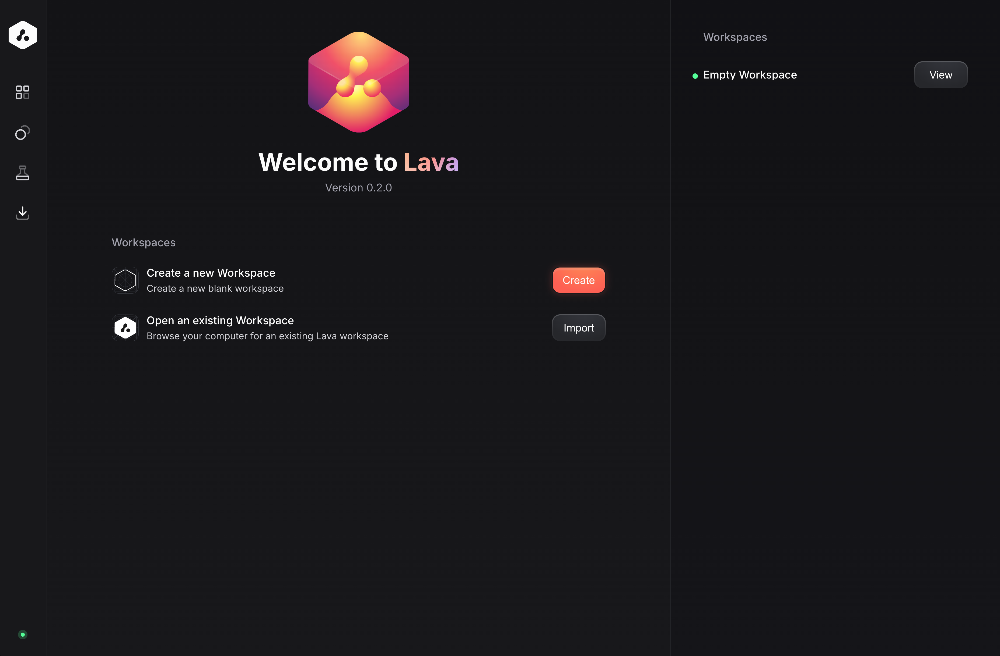

## Prerequisites

Before using Lava, ensure you have the following installed:

-   [Node.js](https://nodejs.org/en/download/)
-   [Yarn](https://yarnpkg.com/getting-started/install)
-   [Anchor](https://www.anchor-lang.com/docs/installation#anchor)

## What is Lava?

Lava integrates directly with the Anchor framework, providing a seamless testing experience for Solana developers. It automates test creation and execution, streamlining the process and helping catch bugs earlier in the development cycle.

## Creating a Basic Counter Program

Let's start by setting up a basic counter program using Anchor. This program will include simple increment and decrement functions that modify the state of a counter stored on the blockchain.

First, create a new Anchor project called `counter-program`.

```bash
anchor init counter-program
```

Next, define the `initialize`, `increment`, and `decrement` instructions for the counter program:

```rust
use anchor_lang::prelude::*;

declare_id!("8sHV6MjJSkemTc34PXrymjmungpjgf7b1np52eSnoLBx");

#[program]
pub mod counter_program {
    use super::*;

    pub fn initialize(ctx: Context<Initialize>) -> Result<()> {
        let counter = &mut ctx.accounts.counter;
        counter.bump = ctx.bumps.counter;
        counter.count = 0;
        Ok(())
    }

    pub fn increment(ctx: Context<Increment>, amount: u64) -> Result<()> {
        require!(
            amount > 0 && amount >= ctx.accounts.counter.count,
            CounterError::InvalidAmount
        );
        ctx.accounts.counter.count += amount;
        Ok(())
    }

    pub fn decrement(ctx: Context<Decrement>, amount: u64) -> Result<()> {
        require!(
            amount > 0 && amount <= ctx.accounts.counter.count,
            CounterError::InvalidAmount
        );
        ctx.accounts.counter.count -= amount;
        Ok(())
    }
}

#[derive(Accounts)]
pub struct Initialize<'info> {
    #[account(
        init,
        seeds = [b"counter", user.key().as_ref()],
        bump,
        payer = user,
        space = Counter::INIT_SPACE
    )]
    pub counter: Account<'info, Counter>,
    #[account(mut)]
    pub user: Signer<'info>,
    pub system_program: Program<'info, System>,
}

#[derive(Accounts)]
pub struct Increment<'info> {
    #[account(mut)]
    pub counter: Account<'info, Counter>,
    #[account(mut)]
    pub user: Signer<'info>,
    pub system_program: Program<'info, System>,
}

#[derive(Accounts)]
pub struct Decrement<'info> {
    #[account(mut)]
    pub counter: Account<'info, Counter>,
    #[account(mut)]
    pub user: Signer<'info>,
    pub system_program: Program<'info, System>,
}

#[account]
pub struct Counter {
    pub count: u64,
    pub bump: u8,
}

impl Counter {
    pub const INIT_SPACE: usize = 8 + 8 + 1;
}

#[error_code]
pub enum CounterError {
    #[msg("Amount must be greater than 0")]
    InvalidAmount,
}
```

Now, build the program and locate its IDL file. It must be a JSON file in the `target/idl` directory.

```bash
anchor build
```

## Generating Tests Using Lava

Now let's move on to using Lava to generate test cases for the `counter-program`. First, access [Lava](https://lava.web3builders.dev/), create a new workspace, and name it "Counter Program".


After creating the workspace, we will have a new dashboard with the workspace name, where we can import the IDL file, create accounts, and generate test cases.

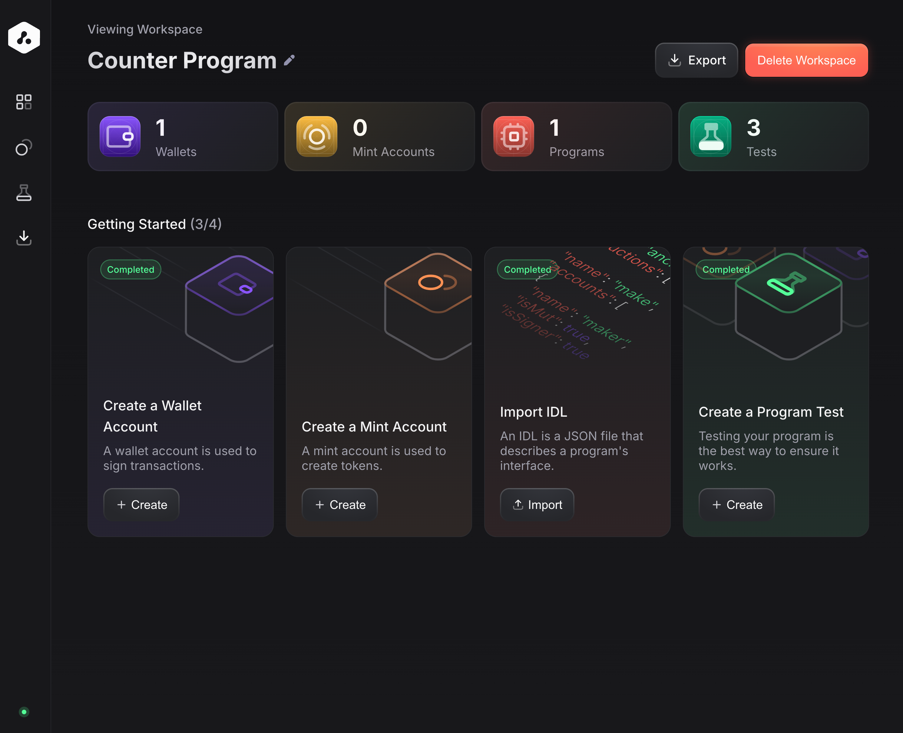

Now, let's click on the "Import IDL" button to import the IDL file generated by Anchor. Import the `counter_program.json` file generated by Anchor by clicking on "Import", it will bring the program name and ID automatically, then just click on "Create Program".

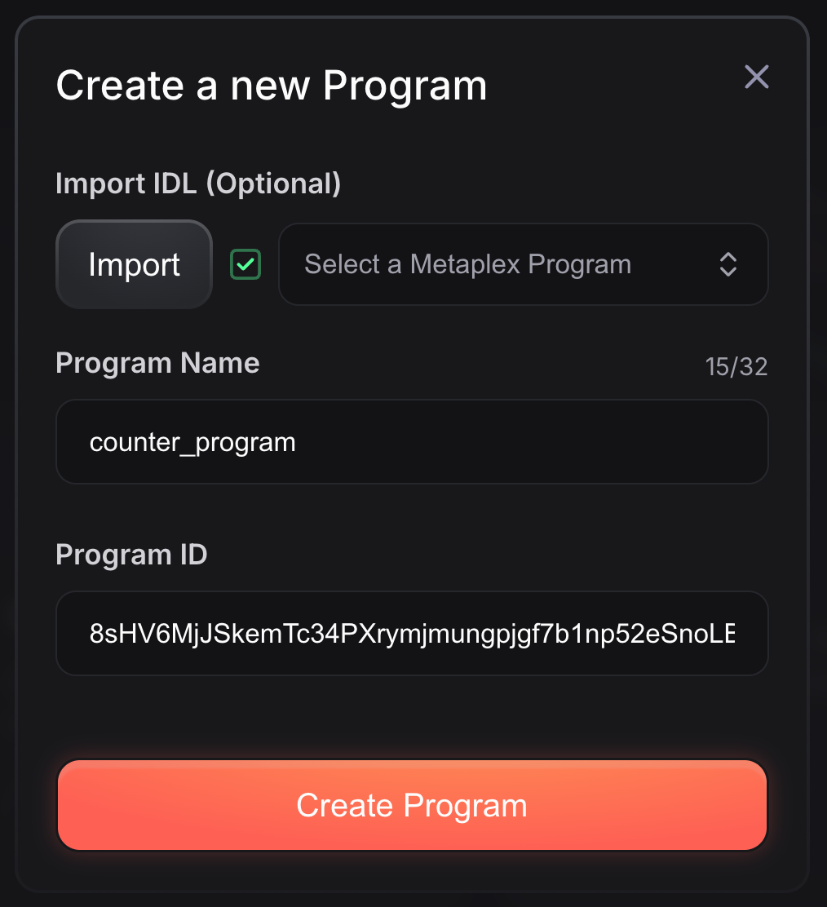

### Account Setup

Next, set up the required accounts for the Counter program, let's head to the Accounts tab on the sidebar.

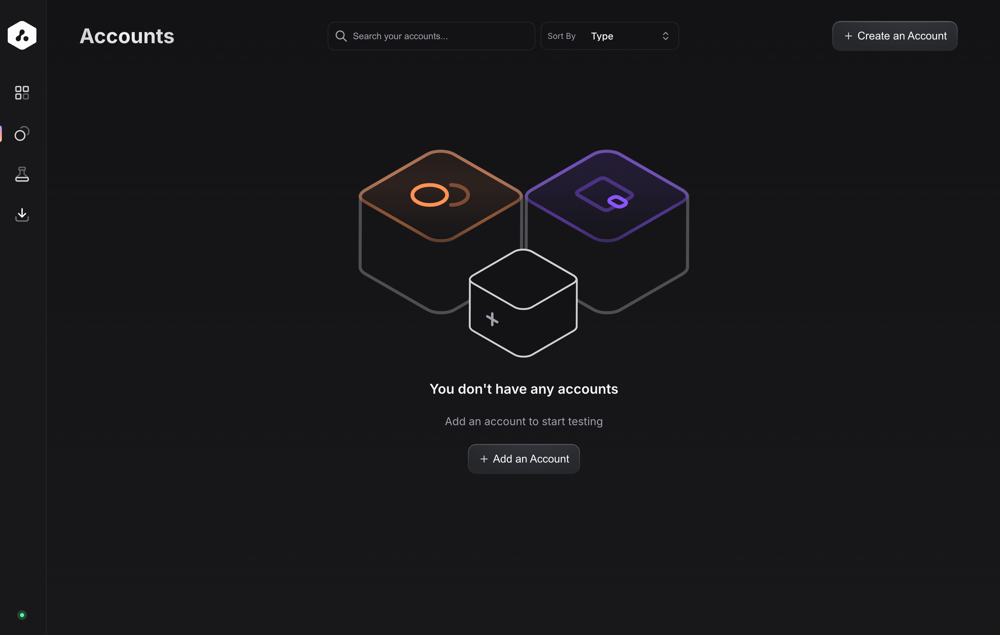

Here we need to click on "Create an Account" or "Add an Account" and select the type of account we want to create: Wallet, Mint, Program or PDA.

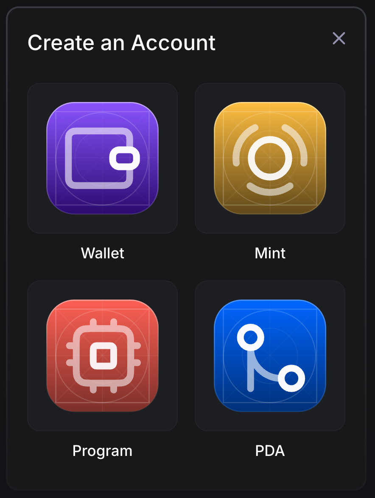

Start by adding the `user` account, which will be of an `Wallet` account type. Name it `user` and assign it some SOL.

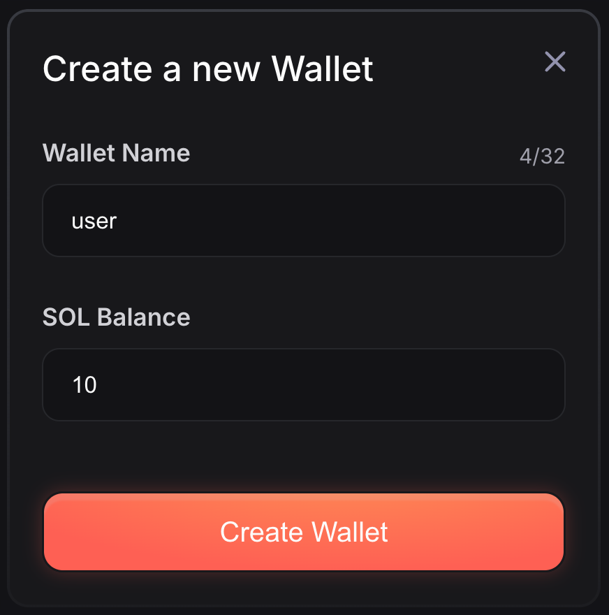

Now, create the Counter PDA account. Click "Create an Account" and then select "PDA". Name it `counter`, and set the seeds to `[b"counter", user.key().as_ref()]`. Lastly, select your `counter_program` and save.

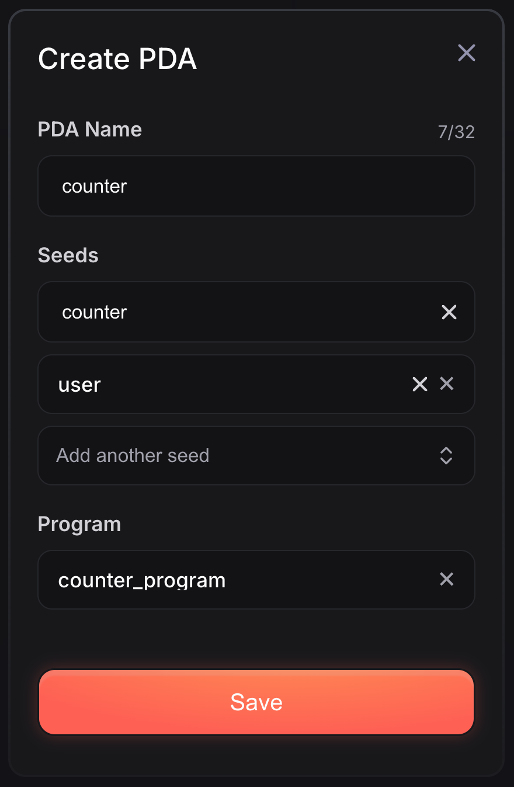

Now that all necessary accounts are set up- the `counter-program` account was created when importing the IDL, we can proceed to create test cases.

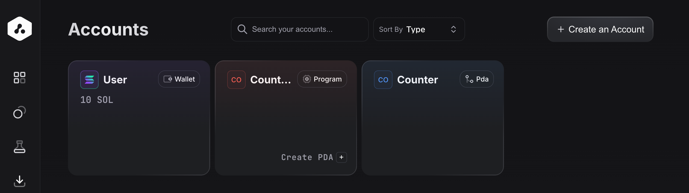

### Creating the Tests

After setting up the accounts, generate the test cases by clicking on "Tests" in the sidebar and selecting "Create a Test".

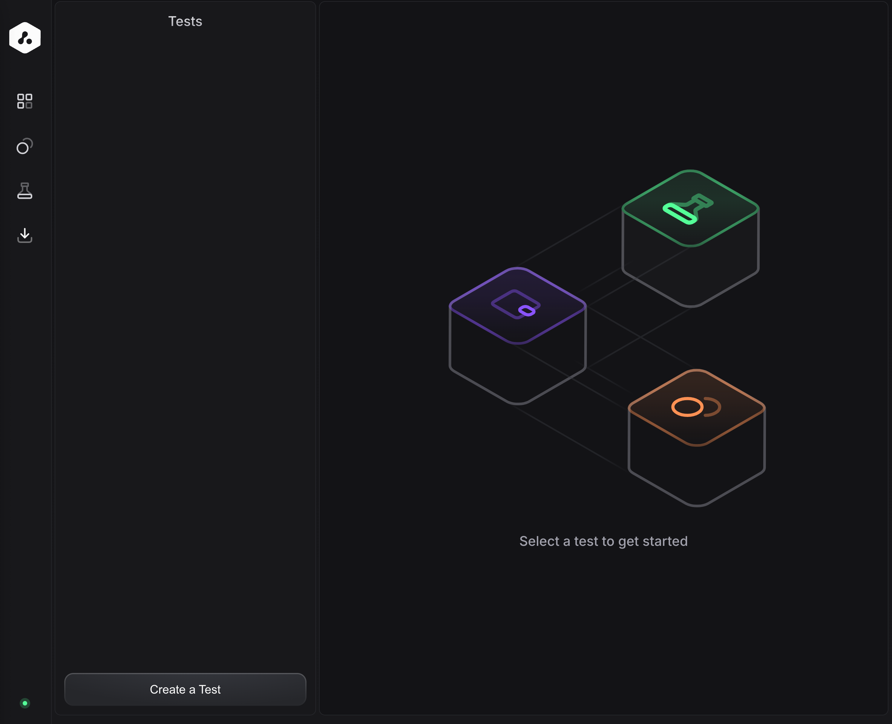

#### Initialize Instruction

For the `initialize` instruction, select it from the options, and ensure the `user` and `counter` accounts are properly configured.

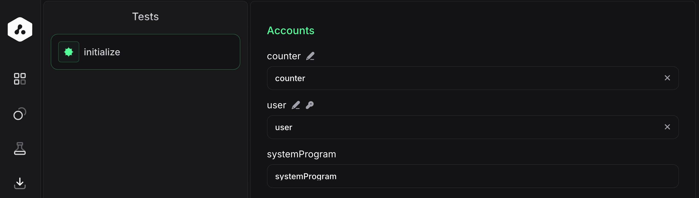

#### Increment and Decrement Instructions

Repeat the process for the `increment` and `decrement` instructions. Set the appropriate accounts and ensure the `amount` arguments are correct.

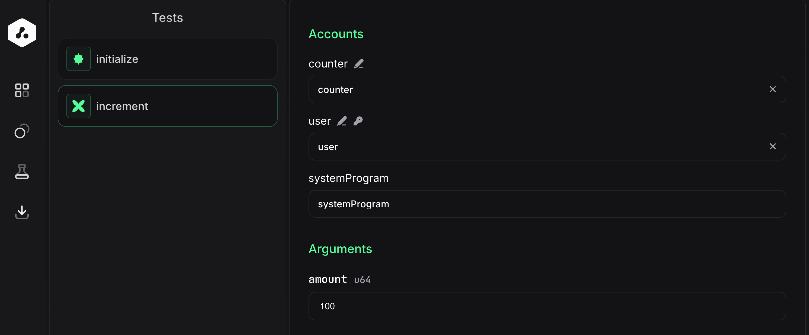

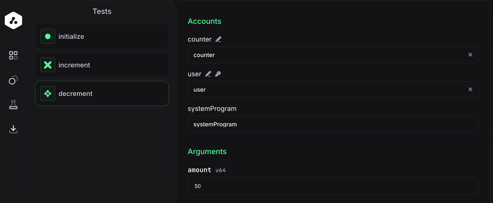

## Exporting Tests to Mocha

Once the tests are created, click on "Export" in the sidebar and then on "Export Tests to Mocha".

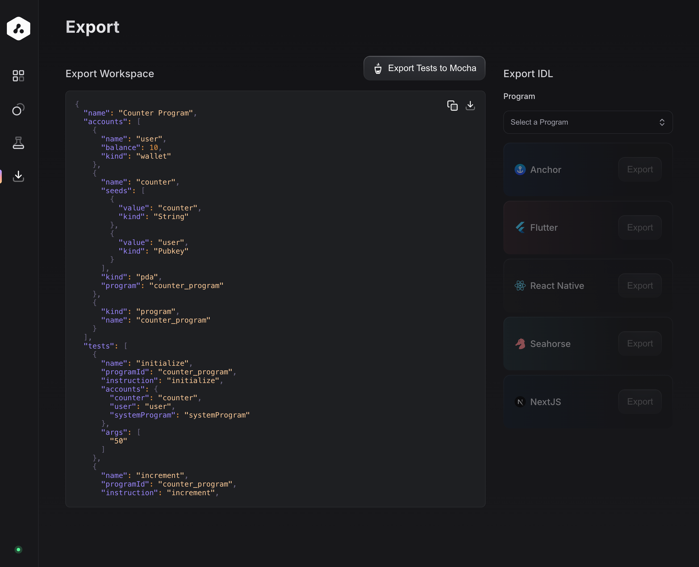

A TypeScript file will be downloaded with the test cases, similar to this:

```typescript
import * as anchor from "@coral-xyz/anchor";
import { Program, BN } from "@coral-xyz/anchor";
import {
	Keypair,
	LAMPORTS_PER_SOL,
	PublicKey,
	SystemProgram,
	Transaction,
} from "@solana/web3.js";
import {
	ASSOCIATED_TOKEN_PROGRAM_ID,
	TOKEN_PROGRAM_ID,
	getMinimumBalanceForRentExemptMint,
} from "@solana/spl-token";

import { CounterProgram } from "../target/types/counter_program";

describe("Counter Program", () => {
	const provider = anchor.getProvider();

	const connection = provider.connection;

	const program = anchor.workspace.CounterProgram as Program<CounterProgram>;

	const user = Keypair.generate();

	const [counter, counterBump] = PublicKey.findProgramAddressSync(
		[Buffer.from("counter"), user.publicKey.toBuffer()],
		program.programId
	);

	const userProvider = new anchor.AnchorProvider(
		connection,
		new anchor.Wallet(user),
		anchor.AnchorProvider.defaultOptions()
	);

	anchor.setProvider(userProvider);

	const userProgram = new anchor.Program(
		program.idl,
		program.programId,
		userProvider
	);

	const confirm = async (signature: string): Promise<string> => {
		const block = await connection.getLatestBlockhash();
		await connection.confirmTransaction({
			signature,
			...block,
		});
		return signature;
	};

	const log = async (signature: string): Promise<string> => {
		console.log(
			`Your transaction signature: https://explorer.solana.com/transaction/${signature}?cluster=custom&customUrl=${connection.rpcEndpoint}`
		);
		return signature;
	};

	const accountsPublicKeys = {
		user: user.publicKey,
		counter,
		associatedTokenprogram: ASSOCIATED_TOKEN_PROGRAM_ID,

		tokenProgram: TOKEN_PROGRAM_ID,

		systemProgram: SystemProgram.programId,
	};

	it("setup", async () => {
		let lamports = await getMinimumBalanceForRentExemptMint(connection);
		let tx = new Transaction();
		tx.instructions = [
			SystemProgram.transfer({
				fromPubkey: provider.publicKey,
				toPubkey: user.publicKey,
				lamports: 10 * LAMPORTS_PER_SOL,
			}),
		];

		await provider.sendAndConfirm(tx).then(log);
	});

	it("Initialize", async () => {
		const accounts = {
			counter: accountsPublicKeys["counter"],
			systemProgram: accountsPublicKeys["systemProgram"],
			user: accountsPublicKeys["user"],
		};

		try {
			await userProgram.methods
				.initialize()
				.accounts({ ...accounts })
				.rpc()
				.then(confirm)
				.then(log);

			const count = (
				await program.account.counter.fetch(counter)
			).count.toNumber();
			console.log("Count", count);
		} catch (error) {
			console.error("Transaction failed:", error);
			if ("logs" in error) {
				console.error("Transaction logs:", error.logs);
			}
			throw error;
		}
	});

	it("Increment", async () => {
		const accounts = {
			counter: accountsPublicKeys["counter"],
			systemProgram: accountsPublicKeys["systemProgram"],
			user: accountsPublicKeys["user"],
		};

		try {
			await userProgram.methods
				.increment(new anchor.BN(100))
				.accounts({ ...accounts })
				.rpc()
				.then(confirm)
				.then(log);

			const count = (
				await program.account.counter.fetch(counter)
			).count.toNumber();
			console.log("Count", count);
		} catch (error) {
			console.error("Transaction failed:", error);
			if ("logs" in error) {
				console.error("Transaction logs:", error.logs);
			}
			throw error;
		}
	});

	it("Decrement", async () => {
		const accounts = {
			counter: accountsPublicKeys["counter"],
			systemProgram: accountsPublicKeys["systemProgram"],
			user: accountsPublicKeys["user"],
		};

		try {
			await userProgram.methods
				.decrement(new anchor.BN(50))
				.accounts({ ...accounts })
				.rpc()
				.then(confirm)
				.then(log);

			const count = (
				await program.account.counter.fetch(counter)
			).count.toNumber();
			console.log("Count", count);
		} catch (error) {
			console.error("Transaction failed:", error);
			if ("logs" in error) {
				console.error("Transaction logs:", error.logs);
			}
			throw error;
		}
	});
});
```

## Running the Tests

Now run the tests using Mocha. Install the necessary dependencies and execute the following command:

```bash
yarn add @solana/spl-token
anchor test
```

After running the tests, you should see output similar to this:

```bash
warning: virtual workspace defaulting to `resolver = "1"` despite one or more workspace members being on edition 2021 which implies `resolver = "2"`
note: to keep the current resolver, specify `workspace.resolver = "1"` in the workspace root's manifest
note: to use the edition 2021 resolver, specify `workspace.resolver = "2"` in the workspace root's manifest
note: for more details see https://doc.rust-lang.org/cargo/reference/resolver.html#resolver-versions
    Finished release [optimized] target(s) in 1.10s

Found a 'test' script in the Anchor.toml. Running it as a test suite!

Running test suite: "/Users/marcelofeitoza/Development/solana/counter-program/Anchor.toml"

yarn run v1.22.22
warning package.json: No license field
$ /Users/marcelofeitoza/Development/solana/counter-program/node_modules/.bin/ts-mocha -p ./tsconfig.json -t 1000000 'tests/**/*.ts'


  Counter Program
Your transaction signature: https://explorer.solana.com/transaction/4Vn6PiMyUMSMUKoZBPiXuWF6iZQejizequj5vod4sikAWSwkA3hoNaJs1GGEAdKBKeb6ZqYMU3PMi8k14RgYXKE9?cluster=custom&customUrl=http://localhost:8899
    ✔ setup (622ms)
Your transaction signature: https://explorer.solana.com/transaction/5r6Gmr11QRBbHZDpmKZdVbhPdAZU3dfViDp5vL4nH6vEx3uu21MeBDeiLejGUENwBcpetjKuLbhCm8ckJr7eYNFy?cluster=custom&customUrl=http://localhost:8899
Count 0
    ✔ Initialize (499ms)
Your transaction signature: https://explorer.solana.com/transaction/3Bp92dFDQ3tzM7je2ZzXcH5b8AZCSNHCsKStuhEyazGjYXA6M7mkK15B79cJheqP5yjC8sAxF8jMDQRBERbt9k8u?cluster=custom&customUrl=http://localhost:8899
Count 100
    ✔ Increment (454ms)
Your transaction signature: https://explorer.solana.com/transaction/3AtARqURzUnK25VNHgpmDyifhT8191b7T6dicKVgkLaKSLKtXUqFZ1Ngy2mp1KwZmtJcwDKLo9FPzMmMLmh9MV5D?cluster=custom&customUrl=http://localhost:8899
Count 50
    ✔ Decrement (478ms)


  4 passing (2s)

✨  Done in 4.78s.
```

## Deploying the Program Using Helius RPC

To deploy the program, generate a Helius RPC endpoint. Head to [https://www.helius.dev/](https://www.helius.dev/) and log in to access your RPC endpoint.

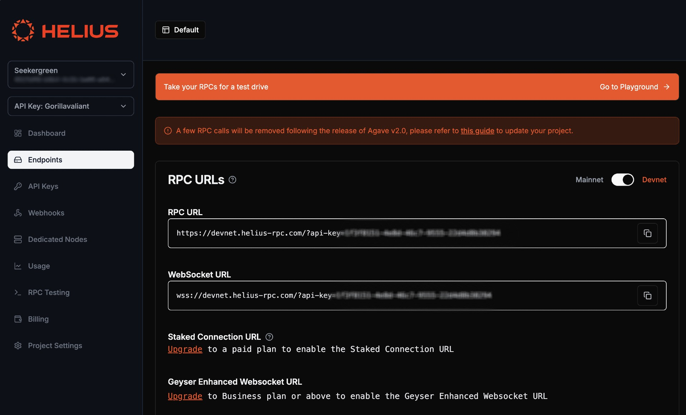

Now, deploy the program using the Helius RPC endpoint with the following command:

```bash
anchor deploy --provider.cluster "https://devnet.helius-rpc.com/?api-key=<your-api-key>"
```

After deploying the program, you should see output similar to this:

```bash
Deploying cluster: https://devnet.helius-rpc.com/?api-key=<your-api-key>
Upgrade authority: /Users/marcelofeitoza/.config/solana/id.json
Deploying program "counter_program"...
Program path: /Users/marcelofeitoza/Development/solana/counter-program/target/deploy/counter_program.so...
Program Id: 8sHV6MjJSkemTc34PXrymjmungpjgf7b1np52eSnoLBx

Deploy success
```

## Credits

Lava was developed by the following team members:

- Juan Marchetto: [GitHub](https://github.com/JuanMarchetto)
- Dean Little: [GitHub](https://github.com/deanmlittle)
- [jyezy](https://github.com/jyezy)

Repository links:

- [Lava](https://github.com/3uild-3thos/lava)
- [Lava CLI](https://github.com/3uild-3thos/lava-cli)

## Conclusion

Lava simplifies Solana program testing by automating test creation and execution, while Helius offers seamless program deployment. Together, these tools help streamline development, ensuring that programs are tested and deployed efficiently.
